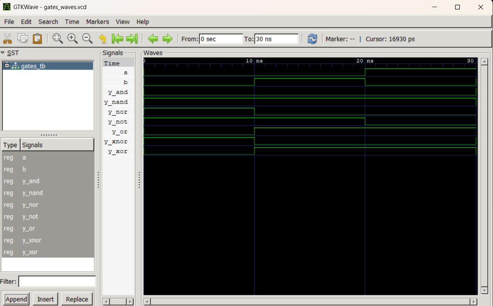

# Lab 2: VHDL Code for Realizing Logic Gates

**Course:** Computer Architecture (CMP 262)
**Program:** Bachelor of Computer Engineering
**Semester:** 4th Semester
**College:** Cosmos College of Management and Technology
**Department:** Department of Information and Communication Technology

---

## Objective

- To write VHDL code for basic logic gates: AND, OR, NOT, NAND, NOR, XOR, and XNOR.
- To simulate each gate and verify its truth table using GTKWave.

---

## Theory

Logic gates are the fundamental building blocks of all digital circuits. Each gate performs a basic Boolean operation on one or more binary inputs to produce a single binary output.

| Gate  | VHDL Operator | Boolean Expression |
|-------|---------------|--------------------|
| AND   | `and`         | Y = A · B          |
| OR    | `or`          | Y = A + B          |
| NOT   | `not`         | Y = Ā              |
| NAND  | `nand`        | Y = A · B̄          |
| NOR   | `nor`         | Y = A + B̄          |
| XOR   | `xor`         | Y = A ⊕ B          |
| XNOR  | `xnor`        | Y = A ⊕ B̄          |

Each gate is implemented in VHDL using the **Dataflow** architectural style, where the output is described as a concurrent signal assignment — meaning the output updates immediately whenever any input changes, just like a real logic gate.

A single combined testbench instantiates all seven gates simultaneously and applies all four possible input combinations (00, 01, 10, 11) at 10 ns intervals. This allows the truth table of every gate to be verified in one simulation run.

### Expected Truth Table

| A | B | AND | OR | NOT A | NAND | NOR | XOR | XNOR |
|---|---|-----|----|-------|------|-----|-----|------|
| 0 | 0 |  0  |  0 |   1   |   1  |  1  |  0  |   1  |
| 0 | 1 |  0  |  1 |   1   |   1  |  0  |  1  |   0  |
| 1 | 0 |  0  |  1 |   0   |   1  |  0  |  1  |   0  |
| 1 | 1 |  1  |  1 |   0   |   0  |  0  |  0  |   1  |

---

## Design Files

Seven separate design files are used, one for each logic gate:

| Gate  | Filename         |
|-------|------------------|
| AND   | `and_gate.vhd`   |
| OR    | `or_gate.vhd`    |
| NOT   | `not_gate.vhd`   |
| NAND  | `nand_gate.vhd`  |
| NOR   | `nor_gate.vhd`   |
| XOR   | `xor_gate.vhd`   |
| XNOR  | `xnor_gate.vhd`  |

Each file defines an entity with the appropriate input/output ports and a Dataflow architecture that uses the corresponding VHDL logical operator to compute the output.

---

## Testbench File

**Filename:** `gates_tb.vhd`

A single combined testbench instantiates all seven gate entities simultaneously using structural port mapping. It declares shared input signals `A` and `B`, individual output signals for each gate, and applies all four input combinations in sequence with 10 ns intervals. This verifies the complete truth table of every gate in a single simulation run.

### Simulation Commands

```bash
# 1. Analyze all design files and the testbench
ghdl -a and_gate.vhd or_gate.vhd not_gate.vhd nand_gate.vhd nor_gate.vhd xor_gate.vhd xnor_gate.vhd gates_tb.vhd

# 2. Elaborate the testbench
ghdl -e GATES_TB

# 3. Simulate and export waveform
ghdl -r GATES_TB --vcd=simulation.vcd

# 4. Open waveform in GTKWave
gtkwave gates_waves.vcd
```

---

## Simulation File

**Filename:** `gates_waves.vcd`

Generated by GHDL after running the testbench. This Value Change Dump (VCD) file records all signal transitions for inputs `A`, `B` and all seven gate outputs over the simulation period. It is loaded into GTKWave for visual verification against the expected truth table.

---

## Output

The waveform was loaded in GTKWave. All input and output signals were appended and the display was zoomed to fit.



---

**Discussion:** In this laboratory experiment, VHDL code was successfully written and implemented for the basic logic gates: AND, OR, NOT, NAND, NOR, XOR, and XNOR. Each gate was described using VHDL syntax and then simulated using a VHDL simulator along with GTKWave for waveform visualization. The simulation results matched the expected truth tables of the respective logic gates.

The AND gate produced a HIGH output only when all inputs were HIGH, while the OR gate generated a HIGH output when at least one input was HIGH. The NOT gate correctly inverted the input signal. Similarly, NAND and NOR gates produced outputs opposite to those of AND and OR gates respectively. The XOR gate generated a HIGH output when the inputs were different, whereas the XNOR gate generated a HIGH output when the inputs were the same.

GTKWave helped in analyzing the timing diagrams and observing the changes in input and output signals clearly. By comparing the simulated outputs with the theoretical truth tables, the correctness of the VHDL code was verified. The experiment also provided practical understanding of hardware description language concepts, digital logic design, and waveform analysis.

---

## Conclusion

The experiment was successfully completed by designing and simulating basic logic gates using VHDL. The outputs obtained from the simulations were verified with the expected truth tables and found to be correct. The use of GTKWave made it easier to visualize and analyze the digital waveforms. This lab helped in understanding the implementation of combinational logic circuits using VHDL and improved familiarity with simulation tools used in digital system design.
